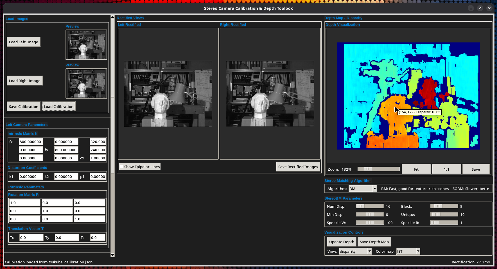

# Stereo Rectification & Depth Toolbox

A Python GUI toolbox for testing and tuning stereo rectification parameters and evaluating the resulting disparity and depth calculations using OpenCV's **StereoBM** and **StereoSGBM** algorithms.



*Figure 1: Graphical user interface of the Stereo Rectification & Depth Toolbox showing camera parameter controls (left), rectified image display (center), and depth/disparity visualization with algorithm parameters (right).*

> ⚠️ **Warning**: The depth calculation functionality has **not been validated** for accuracy. The results produced by this toolbox, especially depth values in millimeters, should be considered **experimental and unverified**. Do not use this toolbox for applications requiring accurate depth measurements without independent validation.

## Purpose

This toolbox helps you:
- **Test stereo rectification parameters** (intrinsics, extrinsics, distortion)
- **Compare disparity/depth results** between StereoBM and StereoSGBM algorithms
- **Tune algorithm parameters** interactively with real-time feedback
- **Validate camera calibration** by visualizing rectified images and epipolar lines

## Features

- **Rectification Testing**: Load and adjust camera intrinsics (K matrix), distortion coefficients, and extrinsics (R, T) to test rectification quality
- **Algorithm Comparison**: Switch between two stereo matching algorithms:
  - **StereoBM** (Block Matching): Fast, suitable for texture-rich scenes
  - **StereoSGBM** (Semi-Global Block Matching): Slower but higher quality with better edge preservation
- **Interactive Parameter Tuning**: Adjust algorithm parameters with real-time disparity/depth preview
- **Depth/Disparity Visualization**: Toggle between disparity (pixels) and depth (mm) views
- **Multiple Colormaps**: JET, VIRIDIS, MAGMA, INFERNO, PLASMA, CIVIDIS
- **Epipolar Line Visualization**: Verify rectification accuracy by checking epipolar line alignment
- **Import/Export**: Save and load calibration files in JSON format

## Requirements

- Python 3.11 or higher
- OpenCV 4.10.0 or higher (required for NumPy 2.x compatibility)
- NumPy 2.0.0 or higher
- Pillow 8.0.0 or higher
- tkinter (standard library, may need separate installation on Linux)

## Installation

### Linux (Ubuntu/Debian)

1. **Install system dependencies:**
   ```bash
   sudo apt update
   sudo apt install python3.11-venv python3.11-tk
   ```

2. **Clone the repository:**
   ```bash
   git clone <repository-url>
   cd stereo_rectify_and_depth_toolbox
   ```

3. **Create virtual environment:**
   ```bash
   python3.11 -m venv venv
   ```

4. **Activate virtual environment:**
   ```bash
   source venv/bin/activate
   ```

5. **Install Python dependencies:**
   ```bash
   pip install -r requirements.txt
   ```

6. **Run the application:**
   ```bash
   python main.py
   ```

### Windows

1. **Install Python:**
   - Download Python 3.11+ from https://www.python.org/downloads/
   - During installation, check "Add Python to PATH"

2. **Clone the repository:**
   ```cmd
   git clone <repository-url>
   cd stereo_rectify_and_depth_toolbox
   ```

3. **Create virtual environment:**
   ```cmd
   py -3.11 -m venv venv
   ```

4. **Activate virtual environment:**
   ```cmd
   venv\Scripts\activate
   ```

5. **Install Python dependencies:**
   ```cmd
   pip install -r requirements.txt
   ```

6. **Run the application:**
   ```cmd
   python main.py
   ```

### macOS

1. **Install Python 3.11 and tkinter:**
   ```bash
   brew install python@3.11
   ```

2. **Clone the repository:**
   ```bash
   git clone <repository-url>
   cd stereo_rectify_and_depth_toolbox
   ```

3. **Create and activate virtual environment:**
   ```bash
   python3.11 -m venv venv
   source venv/bin/activate
   ```

4. **Install Python dependencies:**
   ```bash
   pip install -r requirements.txt
   ```

5. **Run the application:**
   ```bash
   python main.py
   ```

## Usage

### Quick Start

```bash
# Activate virtual environment
# Linux/macOS:
source venv/bin/activate
# Windows:
venv\Scripts\activate

# Run the toolbox
python main.py
```

### Workflow

#### Quick Test with Example Images

The toolbox includes example datasets in the `examples/` folder. To quickly test with the Tsukuba dataset:

1. **Start the toolbox:**
   ```bash
   python main.py
   ```

2. **Load Tsukuba example images:**
   - Click **Load Left Image** → navigate to `examples/tsukuba_left.png`
   - Click **Load Right Image** → navigate to `examples/tsukuba_right.png`

3. **Load Tsukuba calibration:**
   - Click **Load Calibration** → select `examples/tsukuba_calibration.json`
   - The rectified images should appear immediately

4. **Test depth estimation:**
   - Select **SGBM** algorithm for best quality
   - Adjust parameters if needed (default values work well for Tsukuba)
   - Toggle between **disparity** and **depth (mm)** views
   - Try different colormaps (VIRIDIS or JET work well)

#### Full Workflow with Your Images

1. **Load stereo image pair:**
   - Click **Load Left Image** to load the left camera image
   - Click **Load Right Image** to load the right camera image

2. **Test rectification parameters:**
   - **Option A**: Load existing calibration via **Load Calibration** (JSON file)
   - **Option B**: Manually enter intrinsics, distortion, and extrinsics
   - Verify rectification by checking that corresponding points align horizontally
   - Enable **Show Epipolar Lines** to verify alignment (lines should be horizontal)

3. **Compare stereo algorithms:**
   - Select **BM** or **SGBM** from the algorithm dropdown
   - Adjust algorithm-specific parameters using the sliders
   - Observe real-time changes in the disparity/depth visualization

4. **Evaluate depth results:**
   - Toggle between **disparity** (pixel shift) and **depth (mm)** views
   - Hover over the depth map to see values at specific pixels
   - Try different colormaps for better visualization
   - Compare BM vs SGBM results by switching algorithms

### Key Differences: BM vs SGBM

| Aspect | StereoBM | StereoSGBM |
|--------|----------|------------|
| **Speed** | Fast (real-time) | Slower (2-3x BM) |
| **Quality** | Good for textured scenes | Better edge preservation |
| **Parameters** | 6 tunable parameters | 9 tunable parameters (includes P1, P2) |
| **Best for** | Quick testing, texture-rich scenes | High-quality depth, smooth surfaces |

### Keyboard Shortcuts

| Shortcut | Action |
|----------|--------|
| `Ctrl+O` | Load left image |
| `Ctrl+R` | Load right image |
| `Ctrl+S` | Save rectified images |
| `F5` | Refresh rectification |

## Calibration File Format

Calibration files are saved as JSON:

```json
{
  "left_camera": {
    "K": [[fx, 0, cx], [0, fy, cy], [0, 0, 1]],
    "distortion": [k1, k2, p1, p2, k3]
  },
  "right_camera": {
    "K": [[fx, 0, cx], [0, fy, cy], [0, 0, 1]],
    "distortion": [k1, k2, p1, p2, k3],
    "R": [[r11, r12, r13], [r21, r22, r23], [r31, r32, r33]],
    "T": [tx, ty, tz]
  }
}
```

## Algorithm Parameters

### StereoBM Parameters

| Parameter | Description | Range |
|-----------|-------------|-------|
| Num Disp | Number of disparities (must be multiple of 16) | 16-256 |
| Block | Block size for matching (must be odd) | 5-255 |
| Min Disp | Minimum disparity | -100 to 100 |
| Unique | Uniqueness ratio | 1-100 |
| Speckle W | Speckle window size | 0-200 |
| Speckle R | Speckle range | 0-50 |

### StereoSGBM Parameters

| Parameter | Description | Range |
|-----------|-------------|-------|
| Num Disp | Number of disparities (must be multiple of 16) | 16-256 |
| Block | Block size for matching (must be odd) | 5-255 |
| Min Disp | Minimum disparity | -100 to 100 |
| Unique | Uniqueness ratio | 1-100 |
| P1 | Smoothness constraint for similar colors | 0-1000 |
| P2 | Smoothness constraint for edges | 0-2000 |
| PreFilter | Pre-filter cap | 0-100 |
| Speckle W | Speckle window size | 0-200 |
| Speckle R | Speckle range | 0-50 |

## Testing

Run the test suite to verify the toolbox functionality:

```bash
# Activate virtual environment first
source venv/bin/activate  # Linux/macOS
venv\Scripts\activate     # Windows

# Run all tests (core functionality)
python tests/test_all.py

# Run GUI tests (requires X11 display)
python tests/test_gui.py

# Run integration tests
python tests/test_integration.py
```

## Architecture

```
stereo_rectify_and_depth_toolbox/
├── main.py              # Entry point
├── core/
│   ├── rectifier.py     # Stereo rectification (OpenCV)
│   └── depth.py         # Depth estimation (BM & SGBM)
├── gui/
│   ├── main_window.py   # Main application window
│   ├── param_panel.py   # Camera parameter inputs
│   └── image_panel.py   # Image display with zoom/pan
├── tests/
│   ├── test_all.py      # Core tests
│   ├── test_gui.py      # GUI tests
│   └── test_integration.py
├── examples/            # Sample images and calibrations
└── requirements.txt     # Python dependencies
```

## Example Data

The included example datasets use images from the **Tsukuba Stereo Dataset** provided by CVLab, University of Tsukuba.

- **Source**: [CVLab Tsukuba Stereo Dataset](https://home.cvlab.cs.tsukuba.ac.jp/dataset)
- **License**: The dataset is provided for research and educational purposes
- **Usage**: The examples in this toolbox use a subset of the Tsukuba dataset for demonstration purposes

For more datasets and benchmark evaluations, visit the CVLab Tsukuba website.

## Troubleshooting

### Linux: tkinter not found
```bash
sudo apt install python3-tk
```

### Windows: tkinter not found
Reinstall Python and ensure "tcl/tk and IDLE" is checked during installation.

### macOS: tkinter not found
```bash
brew install python-tk
```

### "Invalid camera parameters" error
- Ensure focal lengths (fx, fy) are positive
- Principal point (cx, cy) should be within image bounds
- Check that rotation matrix is valid (orthogonal)

### Poor rectification (misaligned images)
- Verify calibration parameters are accurate
- Check that rotation matrix R is orthogonal
- Ensure translation vector T represents the baseline correctly
- Use epipolar lines to diagnose: they should be horizontal and aligned

### Poor depth quality
- **Try SGBM** instead of BM for better edge preservation
- **Increase P1 and P2** (SGBM) for smoother results on uniform surfaces
- **Adjust Block Size**: larger = smoother, smaller = more detail
- **Increase Uniqueness Ratio** to filter ambiguous matches
- **Enable speckle filtering** (Speckle W > 0) to remove noise
- Ensure images are **well-textured** (textureless regions fail)

### Disparity map is mostly black
- Check that **Num Disparities** is appropriate for your baseline
- Adjust **Min Disparity** if objects are far away
- Verify that rectification is working (images should be horizontally aligned)

## License

BSD 3-Clause License

## Contributing

Contributions are welcome! Please ensure all tests pass before submitting:

```bash
python tests/test_all.py
```
